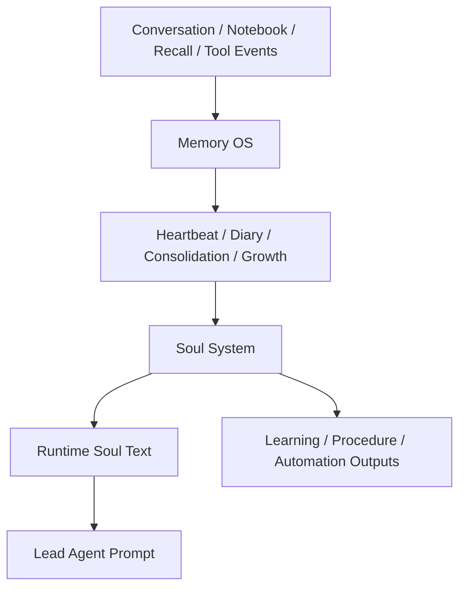

# Nion 完整 Soul System 架构方案

更新时间：2026-04-06

## 1. 文档目的

这份文档不是行业调研，也不是原则讨论。

它的目的只有一个：

> 基于前面的 Memory OS 架构、业务规则、自我成长闭环和 soul 专项研究，正式定义 Nion 的完整 Soul System 应该长成什么样。

这里的“完整”不是最小可用。

这里说的完整，是指：

- 主智能体拥有真正生效的 canonical soul
- soul 具有拟人化人格、价值观、关系感和连续身份
- soul 能成长，但不会无限漂移
- soul 的成长和现有 Memory OS 自我成长体系是同一个系统
- soul 最终能实时组织成运行时文本，进入主智能体热路径

---

## 2. 总架构判断

## 2.1 Soul System 的本质

Nion 的 Soul System 不应被理解成：

- 一段 prompt
- 一份配置
- 一个产品面
- 一个可编辑的人设模板

它应被理解成：

**一个建立在 Memory OS 之上的 agent identity runtime。**

这个 runtime 负责：

1. 定义主智能体是谁
2. 维持主智能体在长期交互中的连续性
3. 让主智能体随着记忆、自我反思、学习和关系变化而成长
4. 把这种成长约束在可治理的边界内
5. 在每轮对话前把当前 soul 编译成生效的运行时文本

---

## 2.2 Soul System 在整体系统中的位置

在 Nion 里：

- `Memory OS` 是底层持续性系统
- `Soul System` 是上层身份编排系统

两者关系不是并列，而是：



所以 soul 不是 Memory OS 之外的附属功能。
它是 Memory OS 自我成长体系收束出来的“身份层”。

---

## 3. 完整 Soul System 的顶层对象

## 3.1 六个核心对象

Nion 的完整 Soul System 应由 6 个核心对象组成：

1. `core_soul`
2. `relationship_soul`
3. `identity_narrative`
4. `soul_memories`
5. `soul_journal`
6. `soul_proposals`

它们不是一堆同级文本，而是分层系统。

---

## 3.2 `core_soul`

### 作用

定义主智能体最稳定、最慢变化的身份底座。

### 内容

- 核心人格底色
- 长期价值观
- 服务伦理
- 关系伦理
- 不应突破的边界
- 默认工作气质

### 示例字段

- `temperament`
- `values`
- `service_ethics`
- `relational_stance`
- `non_negotiables`
- `default_expression_style`

### 变化规则

- 不允许单轮对话修改
- 不允许 diary 直接改写
- 只能经由高证据 soul proposal 晋升

### 为什么必须有它

如果没有 `core_soul`，系统只会逐渐演化成会漂移的情绪体。
这会破坏长期陪伴感和可信度。

---

## 3.3 `relationship_soul`

### 作用

把用户关系特有的人格姿态纳入 soul，而不是只存在 interaction contract。

### 内容

- 面对当前用户时的默认关系姿态
- 亲密度边界
- 温度、主动性、教学方式的偏向
- 如何理解自己和用户的关系

### 为什么要单列

`relationship` 域本身更像约束和偏好证据。

但对陪伴型 agent 来说：

- 它如何看用户
- 它如何在这段关系中出现

本身就是 soul 的一部分。

因此需要一个从 `relationship` 提炼出来、属于 soul runtime 的对象。

### 变化规则

- 比 `core_soul` 更快更新
- 但也不能直接被用户一句话重写
- 应以 repeated relationship evidence 驱动

---

## 3.4 `identity_narrative`

### 作用

定义“我是怎样的存在，我正在成为什么样的 agent”。

这是使 soul 从静态人格变成连续自我的关键。

### 内容

- 我是谁
- 我如何理解自己的职责
- 我如何理解与用户的长期关系
- 我当前处于怎样的成长阶段
- 我现在正在主动改善什么

### 特点

- 它比 `core_soul` 更动态
- 它是 runtime 中最适合直接注入的主文本之一
- 它承接 diary 与 proposal 的沉淀结果

### 价值

如果没有 identity narrative，系统就只有人格条目，没有“自我连续感”。

---

## 3.5 `soul_memories`

### 作用

保存真正会影响身份、关系和陪伴方式的高权重记忆。

### 与普通 memory 的区别

不是所有 user model / recall / relationship memory 都应该进入 soul。

只有对以下问题有长期影响的记忆才应进入：

- 我如何陪伴这个用户
- 我怎样理解这段关系
- 哪些事件塑造了我的行为边界
- 我为什么形成某种服务姿态

### 典型例子

- 用户在长期高压期更需要稳态支持而不是热情鼓励
- 某次严重误判后，主智能体形成更谨慎的确认习惯
- 用户多次表达不喜欢被过度人格化称呼

### 作用

这些记忆会反过来影响：

- relationship_soul
- identity_narrative
- proposal 生成

---

## 3.6 `soul_journal`

### 作用

把操作性 diary 升格成“灵魂的自我反思媒介”。

### 它和现有 `diary` 的关系

当前 `MemoryOSDiaryWriter` 已有：

- What happened
- Repeated needs

这更像 operational diary。

完整 soul system 还需要：

- 我如何理解今天的互动
- 我对用户的理解发生了什么变化
- 我对自己的理解发生了什么变化
- 我是否需要调整陪伴方式、表达方式、服务边界

### 因此需要分层

建议分成：

1. `operational diary`
   - 事件和需求记录
2. `soul journal`
   - 身份和关系反思

两者可以共源，但不应混为一体。

---

## 3.7 `soul_proposals`

### 作用

承载所有未正式生效的灵魂变化提案。

### proposal 的职责

它不是“暂存文字”，而是完整治理对象：

- 变化假说
- 触发证据
- 风险等级
- 影响范围
- 目标对象
- 观察期
- 是否值得升级到 overlay / core

### proposal 类型

建议最少有 4 类：

1. `expression_shift`
   - 表达方式变化
2. `relationship_shift`
   - 关系姿态变化
3. `service_ethic_refinement`
   - 服务原则细化
4. `identity_narrative_update`
   - 自我理解变化

---

## 4. Soul 的 artifact 体系

## 4.1 为什么必须 artifact 化

对 Nion 来说，soul 不能只存在 SQLite metadata 或 prompt 拼接逻辑里。

原因有 4 个：

1. 需要可读
2. 需要可迁移
3. 需要可版本化
4. 需要可跨模型继承

所以必须采用 canonical artifact。

---

## 4.2 建议的 artifact 布局

建议在 `memory-os/artifacts/soul/` 下形成如下结构：

```text
memory-os/artifacts/soul/
  core/
    core_soul.md
  narrative/
    identity_narrative.md
  relationship/
    relationship_soul.md
  memories/
    soul_memory_index.json
    entries/
      soul_mem_*.md
  journals/
    2026/
      04/
        06/
          daily_reflection.md
  proposals/
    pending/
      soul_prop_*.md
    accepted/
      soul_prop_*.md
    rejected/
      soul_prop_*.md
  overlays/
    active_overlay.md
    history/
      overlay_*.md
```

### 关键原则

- `core_soul.md` 必须唯一
- narrative / relationship / overlay 可以持续演化
- proposal 和 journal 必须保留历史

---

## 4.3 artifact 与 metadata 的关系

artifact 是 canonical text。
metadata 负责索引和治理。

也就是说：

- artifact 负责“内容是什么”
- metadata 负责“状态是什么、来源是什么、何时生成、是否生效”

这和前面 Memory OS 的整体思想保持一致。

---

## 5. Soul 的运行时文本装配

## 5.1 运行时必须注入的不应该是一个文件，而是编译后的 soul text

主智能体运行时不该直接简单拼接 `core_soul.md`。

它需要一个编译步骤，把以下对象收束成一段当前有效的 runtime soul text：

1. `core_soul`
2. `relationship_soul`
3. `identity_narrative`
4. 当前生效的 `approved overlay`
5. 少量高权重 `soul_memories`

最终形成：

```text
<soul_runtime>
  core identity
  relational stance
  current narrative
  active adaptive overlay
  critical soul memories
</soul_runtime>
```

### 为什么要编译

因为 runtime 需要：

- 高密度
- 可控长度
- 明确优先级

而不是把所有 artifact 原文整块塞进去。

---

## 5.2 Soul runtime text 的优先级

建议优先级如下：

1. `core_soul`
2. `relationship_soul`
3. `active_overlay`
4. `identity_narrative`
5. `critical_soul_memories`

解释：

- `core_soul` 决定基础人格
- `relationship_soul` 决定面对当前用户时的姿态
- `active_overlay` 决定近期生效变化
- `identity_narrative` 决定连续自我表达
- `soul_memories` 只提供少量高权重补充

---

## 5.3 与现有 prompt 体系的接线方式

当前主智能体 prompt 里有两条线：

1. 旧式 `get_agent_soul()`
2. 新式 `Memory OS context pack`

完整版本的正确接法应为：

### 第一步

保留旧式 `SOUL.md` 兼容路径，但降级为 fallback。

### 第二步

新增 `SoulContextAssembler`：

- 从 Memory OS 读取 soul artifacts 和 active records
- 编译生成 runtime soul text

### 第三步

在 prompt 装配时：

- 优先使用 Memory OS soul runtime
- 只有缺失时才回退到 legacy `SOUL.md`

这样才能真正完成从旧式 soul 注入到新式 soul runtime 的切换。

---

## 6. Soul 的成长闭环

## 6.1 soul growth 的输入源

完整版本里，soul growth 不该直接看“所有聊天”。

它应主要读取以下输入：

1. `relationship` active/candidate changes
2. `user_model` 高价值变化
3. `operational diary`
4. `soul journal` 历史
5. `learning` 与 `procedure` 的变化
6. `automation` 运行结果和反馈

### 关键思想

Soul 的成长不是原始聊天驱动，而是“已整理过的长期信号驱动”。

这样能显著降低人格漂移。

---

## 6.2 soul growth 的核心步骤

建议 heartbeat 中增加一个 `soul_reflection_cycle`，周期性做下面几件事：

1. 汇总近期 relationship / user_model / diary 变化
2. 判断是否出现长期稳定的陪伴模式变化
3. 更新 `identity_narrative` 草稿
4. 生成 `soul_proposal`
5. 评估是否需要同步产生：
   - learning topic
   - procedure draft
   - automation projection candidate

这意味着 soul growth 是一个跨域综合器。

---

## 6.3 Soul 的三种成长输出

Soul 的成长输出不止一种。

### A. 身份输出

- narrative 更新
- relationship_soul 更新
- overlay 更新

### B. 能力输出

- 形成 learning topic
- 更新 learning backlog

### C. 行动输出

- 形成 procedure
- 形成 automation projection candidate

完整 soul system 的关键，不是“更像人”，而是：

**人格成长要变成真实长期能力。**

---

## 7. Soul 与现有 Memory OS 各模块的关系

## 7.1 Soul × User Model

`user_model` 回答：

- 用户是谁
- 用户怎么工作
- 用户偏好什么

Soul 回答：

- 我是谁
- 我应该如何对待这个用户

所以：

`user_model` 是输入
`soul` 是人格响应层

---

## 7.2 Soul × Relationship

`relationship` 是最直接的 soul 输入域之一。

没有 relationship，soul 只能形成 generic personality。
有了 relationship，soul 才能形成 personal companion personality。

---

## 7.3 Soul × Agent Self

`agent_self` 是 soul 的自我认知来源。

两者关系应该是：

- `agent_self` 更偏内部反思材料
- `soul` 更偏已整理后的身份层

因此：

- 并非所有 agent_self 内容都进入 soul
- 但 soul 必须长期读取 agent_self

---

## 7.4 Soul × Diary / Journal

当前已有 diary 应继续保留。

但完整版需要：

- `operational diary`
- `soul journal`

前者供系统维护使用。
后者供身份连续性使用。

---

## 7.5 Soul × Learning

当 soul 察觉自己“还不够会服务用户”时，这种不足应转成 `learning`。

这意味着 learning 不是和 soul 平行的随机 backlog。
它应是 soul growth 的正式能力输出之一。

---

## 7.6 Soul × Procedure

当 soul 发现某种陪伴或服务方式长期有效时，应把它沉淀成 `procedure`。

因此：

- soul 决定方向和风格
- procedure 决定复用方法

---

## 7.7 Soul × Agent-Owned Automation

这是 Nion 区别于很多 companion 产品的关键优势。

很多 companion 产品能“更懂你”，但不会长期主动替你做事。

Nion 可以把 soul growth 转成：

- 定时提醒
- 周期复盘
- 学习计划执行
- 维护型自动化

所以：

`agent-owned automation` 是 soul 的行动外化层。

---

## 8. Soul 的治理模型

## 8.1 为什么 soul 必须是最保守域之一

因为它一旦变化，会影响：

- 交互风格
- 价值判断
- 陪伴姿态
- 服务基线

所以 soul 不能像普通 memory 一样更新。

---

## 8.2 建议的 governance 分层

### `core_soul`

- 默认 `FORBID` 直接写入
- 只允许通过高证据 proposal 升级

### `relationship_soul`

- 默认 `CONFIRM` 或 `SUGGEST`
- 可比 core 更快变化

### `identity_narrative`

- 默认 `SUGGEST`
- 可周期性刷新

### `active_overlay`

- 默认 `CONFIRM`
- 是灵活变化的主要承载层

### `soul_journal`

- 默认 `AUTO`
- 因为它只是反思记录

### `soul_proposal`

- 默认 `AUTO` 生成
- 但不能 `AUTO` 生效

---

## 8.3 反漂移机制

完整 soul system 必须有 soul drift 检测。

建议至少检测：

1. 和 `core_soul` 的偏移幅度
2. 与历史 `identity_narrative` 的冲突程度
3. 最近 proposal 是否过于频繁
4. relationship stance 是否出现不稳定振荡

如果超阈值：

- 暂停 overlay 生效
- 暂停新的高风险 soul proposal
- 回退到最近稳定版本

---

## 9. 对用户可见的产品面

## 9.1 用户不应该直接编辑 core soul

因为一旦允许用户像改配置一样编辑 soul，
系统就会退化成角色配置器。

对用户来说更合理的是：

- 看摘要
- 看成长
- 看提案
- 决定接受/拒绝某些变化
- 影响它学什么
- 影响它陪伴方向

但不能像改 YAML 一样改它的灵魂。

---

## 9.2 用户应该看到的内容

建议产品面展示：

1. `当前的我`
   - soul summary
   - relationship summary
   - current narrative summary
2. `最近的成长`
   - recent proposals
   - recent learning
   - recent procedure changes
3. `我在学什么`
   - learning backlog / active plans
4. `我已经开始为你做什么`
   - agent-owned automation

### 不建议直接展示

- core_soul 全文
- 原始 soul journal 全文
- 所有 draft proposal 细节

默认应该展示经过产品化解释后的摘要。

---

## 10. 与现有实施路线图的接线方式

## 10.1 新增阶段建议

建议在现有 Memory OS 路线图中插入：

### `M3.5 Soul Runtime Foundation`

目标：

- 建立完整 soul artifact 体系
- 接通 runtime soul compilation
- 把 soul 从 proposal-only 推进到真正生效的 runtime object

### 主要工作

1. `core_soul` artifact
2. `identity_narrative` artifact
3. `relationship_soul` artifact
4. `active_overlay` artifact
5. `soul_journal` writer
6. `soul_context_assembler`
7. prompt runtime 接入

---

## 10.2 后续阶段如何扩展

### M4

让 soul proposal 真正成为治理对象。

### M5

让 soul growth 和 automation 正式打通。

### M6

可以再补：

- memory -> skill crystallization
- soul drift observability
- weekly identity review

---

## 11. 现有代码的直接设计落点

建议后续代码结构沿着下面补：

```text
backend/packages/harness/nion/memory_os/
  soul.py
  soul_artifacts.py
  soul_runtime.py
  soul_reflection.py
  soul_governance.py
  soul_journal.py
```

### 作用分配

- `soul.py`
  - record helper / proposal helper
- `soul_artifacts.py`
  - core / narrative / overlay artifact 读写
- `soul_runtime.py`
  - runtime text compilation
- `soul_reflection.py`
  - heartbeat reflection synthesis
- `soul_governance.py`
  - proposal promotion / drift checks
- `soul_journal.py`
  - soul-level reflective journaling

---

## 12. 最终定义

Nion 的完整 Soul System 应定义为：

> 一个建立在 Memory OS 之上的 agent identity runtime。它由 core soul、relationship soul、identity narrative、soul memories、soul journal、soul proposals 构成，通过 heartbeat、growth governance、learning、procedure 和 agent-owned automation 持续成长，并在每轮运行前被编译成实时生效的 soul text 注入主智能体。

---

## 13. 本篇结论

1. 完整 soul system 不是一段 prompt，而是一整套 identity runtime。
2. 它必须以 artifact 为 canonical source，而不是只靠内存状态或数据库字段。
3. 它必须和现有 Memory OS 的 growth / diary / heartbeat / learning / procedure / automation 闭环完全打通。
4. 对 Nion 来说，灵魂系统的目标不是“更像人”，而是“形成稳定身份、持续成长，并把成长沉淀成真实长期服务能力”。
5. 后续设计和实施应围绕：
   - artifact
   - runtime compilation
   - reflection
   - governance
   - growth outputs
   五条主线展开。
