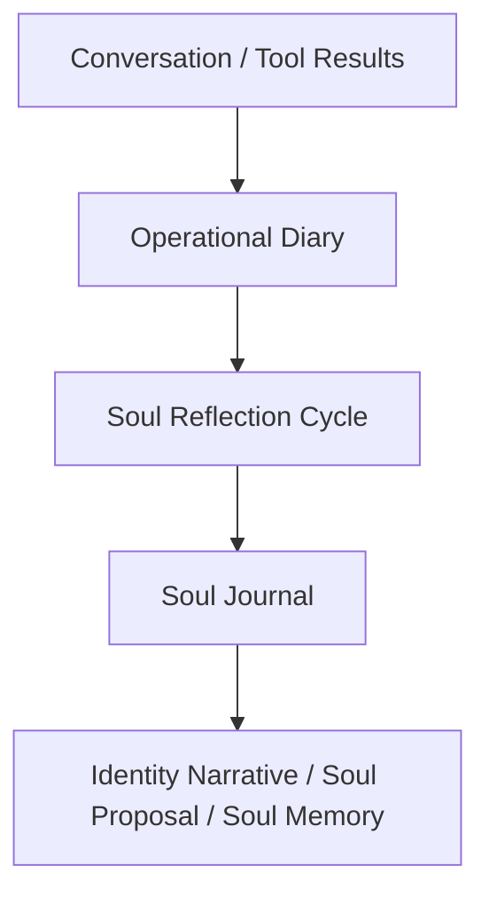

# Soul Growth And Reflection Rules

## 1. Purpose

这份文档是 Soul System 实施前置规格的第三篇。

它负责冻结：

- Soul System 如何从现有 Memory OS 自我成长体系中成长出来
- soul growth 的输入信号源
- `operational diary` 与 `soul journal` 的职责分层
- heartbeat 中 soul reflection 的运行规则
- soul proposal / soul memory / identity narrative / relationship soul 的晋升规则
- soul growth 如何输出到 `learning / procedure / automation`

它**不**负责：

- soul 对象本身的数据字段
- runtime 编译细节
- proposal 接受/拒绝的治理等级
- 产品前台如何解释 soul growth

这些分别交给：

- [13-soul-data-contracts.md](/Users/zhangtiancheng/Documents/项目/agent/nion/.worktrees/codex-memory-os-m0-contract-foundation/docs/memory-update/13-soul-data-contracts.md)
- [14-soul-runtime-compilation.md](/Users/zhangtiancheng/Documents/项目/agent/nion/.worktrees/codex-memory-os-m0-contract-foundation/docs/memory-update/14-soul-runtime-compilation.md)
- `16-soul-governance-matrix.md`
- `17-soul-product-interaction-model.md`

---

## 2. Inputs

本篇依赖：

- [11-soul-memory-os-integration.md](/Users/zhangtiancheng/Documents/项目/agent/nion/.worktrees/codex-memory-os-m0-contract-foundation/docs/memory-update/11-soul-memory-os-integration.md)
- [12-nion-complete-soul-system-architecture.md](/Users/zhangtiancheng/Documents/项目/agent/nion/.worktrees/codex-memory-os-m0-contract-foundation/docs/memory-update/12-nion-complete-soul-system-architecture.md)
- [13-soul-data-contracts.md](/Users/zhangtiancheng/Documents/项目/agent/nion/.worktrees/codex-memory-os-m0-contract-foundation/docs/memory-update/13-soul-data-contracts.md)
- [02-memory-os-business-rules.md](/Users/zhangtiancheng/Documents/项目/agent/nion/docs/memory-update/02-memory-os-business-rules.md)
- [04-memory-os-runtime-flows.md](/Users/zhangtiancheng/Documents/项目/agent/nion/docs/memory-update/04-memory-os-runtime-flows.md)
- [08-memory-os-observability-and-risk.md](/Users/zhangtiancheng/Documents/项目/agent/nion/docs/memory-update/08-memory-os-observability-and-risk.md)
- 当前代码中的：
  - [backend/packages/harness/nion/memory_os/heartbeat.py](/Users/zhangtiancheng/Documents/项目/agent/nion/.worktrees/codex-memory-os-m0-contract-foundation/backend/packages/harness/nion/memory_os/heartbeat.py)
  - [backend/packages/harness/nion/memory_os/diary.py](/Users/zhangtiancheng/Documents/项目/agent/nion/.worktrees/codex-memory-os-m0-contract-foundation/backend/packages/harness/nion/memory_os/diary.py)
  - [backend/packages/harness/nion/memory_os/learning.py](/Users/zhangtiancheng/Documents/项目/agent/nion/.worktrees/codex-memory-os-m0-contract-foundation/backend/packages/harness/nion/memory_os/learning.py)
  - [backend/packages/harness/nion/memory_os/procedures.py](/Users/zhangtiancheng/Documents/项目/agent/nion/.worktrees/codex-memory-os-m0-contract-foundation/backend/packages/harness/nion/memory_os/procedures.py)
  - [backend/packages/harness/nion/memory_os/soul.py](/Users/zhangtiancheng/Documents/项目/agent/nion/.worktrees/codex-memory-os-m0-contract-foundation/backend/packages/harness/nion/memory_os/soul.py)

---

## 3. Decisions

本篇冻结以下关键决策：

1. Soul growth 不是一条平行于 Memory OS 的独立成长管线，而是建立在 `candidate -> diary -> heartbeat -> growth objects` 之上的高层身份成长回路。
2. Soul growth 不直接读取所有原始对话，而主要读取已整理过的长期信号。
3. `operational diary` 记录事件与需求，`soul journal` 记录身份与关系反思，两者必须分层。
4. 单轮对话、单次 diary、单次情绪波动都不能直接改写 soul。
5. soul growth 的输出不只包括人格变化，还包括 `learning / procedure / automation` 三类外化能力。

---

## 4. Soul Growth Objective

Soul growth 的目标不是“让 agent 更像人说话”。

它的目标是：

1. 让 agent 形成更稳定的自我理解
2. 让 agent 更准确地形成对用户的关系姿态
3. 让长期有效的陪伴与服务方式沉淀为 soul-adjacent behavior
4. 让成长最终转化成真实能力，而不是只停留在叙事层

---

## 5. Allowed Signal Sources

## 5.1 Primary Signals

允许触发 soul growth 的主信号源冻结为：

1. `relationship.active / candidate` 的 repeated change patterns
2. `user_model.active` 中与互动方式强相关的高价值变化
3. `operational diary` 中反复出现的关系、边界、陪伴模式
4. `learning` 的持续积压或完成反馈
5. `procedure` 的长期复用与有效性
6. `agent-owned automation` 的执行反馈

### 解释

这些信号都已经经过某种形式的整理或长期积累，
比原始聊天更适合驱动 soul growth。

## 5.2 Secondary Signals

以下信号允许辅助使用，但不能单独触发 soul change：

1. 单轮高情绪强度对话
2. 单次用户投诉或表扬
3. 单次 agent 自我反思
4. 单次任务失败

---

## 6. Forbidden Signal Sources

以下信号禁止直接推动 soul growth：

1. 单轮 prompt 里的角色设定命令
2. 用户一次性要求“以后你就变成这样”
3. 原始 recall 片段未整理全文
4. 单次 `soul_journal` 条目
5. 单次 proposal 的自我引用

原因：

- 容易被噪声劫持
- 容易人格漂移
- 会把 soul 退化成会跟风的风格层

---

## 7. `Operational Diary` vs `Soul Journal`

## 7.1 `Operational Diary`

职责冻结为：

- 记录发生了什么
- 记录 repeated needs
- 为 consolidation 提供 operational evidence

它回答的问题是：

- 今天发生了什么
- 出现了哪些重复需求
- 哪些服务场景值得继续跟踪

## 7.2 `Soul Journal`

职责冻结为：

- 记录我如何理解这些变化
- 记录我如何理解自己与用户的关系变化
- 为 narrative / proposal / soul memory 提供 identity evidence

它回答的问题是：

- 这意味着我应该成为什么样的 agent
- 这意味着我和用户关系应如何调整
- 我是不是需要改变长期姿态

## 7.3 关系

两者关系应为：

---

## 8. Soul Reflection Cycle

## 8.1 定义

`soul_reflection_cycle` 是 heartbeat 中专门负责身份反思的子循环。

## 8.2 输入

它读取：

1. 最近一段时间的 `operational diary`
2. 新增或变化的 `relationship` items
3. 新增或变化的高价值 `user_model` items
4. 近期 `learning / procedure / automation` 状态变化
5. 上一版 `identity_narrative`
6. 当前 `relationship_soul / active_overlay`

## 8.3 输出

它可输出：

1. `SoulJournalEntry`
2. `SoulProposalRecord`
3. `SoulMemoryRecord`
4. `IdentityNarrativeArtifact` draft
5. `RelationshipSoulArtifact` draft
6. `LearningTopic` candidate
7. `ProcedureRecord` draft
8. `AutomationProjection` candidate

---

## 9. Soul Proposal Trigger Rules

## 9.1 可进入 `soul_proposal` 的条件

以下条件至少满足其一，且必须有 repeated evidence：

1. 最近多次关系信号指向同一关系姿态调整
2. 多次 diary / journal 反思指向同一身份变化方向
3. 某种服务方式在 procedure 层反复有效，并开始反过来影响人格表现
4. 某类用户偏好长期稳定，足以改变陪伴策略

## 9.2 明确禁止

以下情况不能进入 `soul_proposal`：

1. 一次聊天里用户要求 agent 改人格
2. 一次高情绪互动后 agent 立即重新定义自己
3. diary 里一次性的自我感慨
4. 单次任务失败引发的过度人格修正

---

## 10. Soul Memory Promotion Rules

## 10.1 进入 `soul_memory` 的条件

`SoulMemoryRecord` 必须满足：

1. 影响的是身份、陪伴方式、关系姿态，而非普通事实
2. 有 repeated evidence 或关键事件级证据
3. 预计会持续影响未来行为

## 10.2 例子

允许：

- 用户长期不接受“过度热情式安慰”，agent 因此形成稳态支持姿态
- 用户多次表达希望 agent 少拟人化称呼，长期影响关系风格
- 某次重大误判后形成长期谨慎确认机制

不允许：

- 用户今天心情不好
- 用户今晚加班
- 某次聊天里用了一个昵称

---

## 11. Identity Narrative Refresh Rules

## 11.1 触发条件

以下情况可触发 narrative refresh：

1. 新的 soul proposal 被接受
2. relationship soul 明显变化
3. learning / procedure 形成新的长期成长方向
4. 一段时期内 soul journal 反复指向同一自我理解变化

## 11.2 刷新原则

1. narrative 必须和当前 core soul 一致
2. narrative 可以比 core 更动态
3. narrative 不得反向改写 core 的根原则

---

## 12. Relationship Soul Refresh Rules

## 12.1 触发条件

以下情况可触发 `relationship_soul` 更新：

1. `relationship` 域 repeated evidence 指向稳定改变
2. 用户长期偏好变化影响陪伴方式
3. 已批准 overlay 对关系姿态造成长期影响

## 12.2 禁止事项

以下情况不得触发关系人格更新：

1. 用户单次高压或单次脆弱表达
2. 单次争执或单次高度亲密表达
3. 一次性实验性角色扮演

---

## 13. Soul Growth Output Mapping

## 13.1 输出到 `learning`

当 soul 发现：

- 自己在某类长期陪伴或服务场景中持续不足

应形成 `learning topic`。

例：

- 不擅长陪用户做长期情绪复盘
- 不擅长在高压周期里稳定提供工作支持

## 13.2 输出到 `procedure`

当 soul 发现：

- 某种陪伴/服务方式稳定有效

应形成 `procedure draft`。

例：

- 在压力期优先给结论 + 降低情绪压强 + 只给 1-2 个下一步

## 13.3 输出到 `automation`

当 soul 发现：

- 某类周期性关心或支持行为应持续发生

可形成 `agent-owned automation candidate`。

例：

- 每周一次低打扰复盘提醒
- 某个工作节律下的预热总结任务

---

## 14. Soul Drift Prevention Rules

## 14.1 Drift 定义

当以下现象发生时，视为 soul drift 风险：

1. 短时间 proposal 数量异常升高
2. relationship stance 前后振荡
3. narrative 与 core soul 明显冲突
4. overlay 对 core 的覆盖过强

## 14.2 防护规则

1. 任何单轮信号都不能直接造成 soul 生效变化
2. proposal 必须来自多源 evidence
3. overlay 必须可回退
4. drift 风险升高时暂停新的高风险 soul proposal 生成

---

## 15. Runtime / Product Impact

## 15.1 对 runtime 的影响

本篇输出给 [14-soul-runtime-compilation.md](/Users/zhangtiancheng/Documents/项目/agent/nion/.worktrees/codex-memory-os-m0-contract-foundation/docs/memory-update/14-soul-runtime-compilation.md) 的关键边界是：

1. runtime 读取的是长期整理后的 soul objects
2. runtime 不读 raw journal
3. runtime 只读取 approved / active 层

## 15.2 对 governance 的影响

本篇输出给 `16` 的关键边界是：

1. `soul_journal` 默认高自治
2. `soul_proposal` 默认可自动生成
3. `overlay / core` 升级必须更保守

## 15.3 对产品面的影响

本篇输出给 `17` 的关键边界是：

1. 用户应看到成长结果与理由
2. 用户不应直接看到全部反思原文
3. 用户不能像编辑配置一样直接改核心人格

---

## 16. Open Questions

1. `soul_reflection_cycle` 的默认 cadence 是 daily、weekly，还是 daily + weekly 双层。
2. `SoulMemoryRecord` 是否需要单独的人格影响评分，而不只是 `salience`。
3. `relationship_soul` 是否在多用户未来形态下按用户各自维护，还是再引入 shared layer。
4. `learning` 与 `soul` 的因果关系是否需要显式 provenance 字段连接。
5. `automation feedback` 进入 soul growth 时，负反馈是否应权重高于正反馈。

---

## 17. 本篇结论

1. Soul growth 必须建立在现有 Memory OS 自我成长体系之上，而不是单独造管线。
2. `operational diary` 与 `soul journal` 必须分层。
3. 单轮对话、单次情绪、单次 diary 都不能直接改变 soul。
4. soul growth 的结果必须能外化为 `learning / procedure / automation`，否则它只是人格文本变化。
5. 本篇为 `16-soul-governance-matrix.md` 提供动作分层依据，也为 `17-soul-product-interaction-model.md` 提供产品解释基础。
