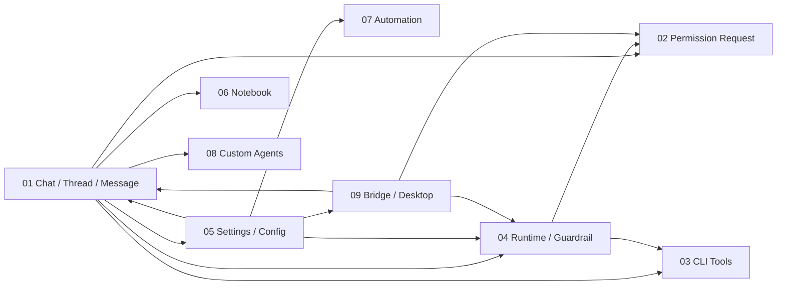

# Nion 测试文档总览

## 总览索引
- 模块 01：Chat / Thread / Message 主链路
- 模块 02：Permission Request 权限请求链路
- 模块 03：CLI Tools 工具目录与运行时联动
- 模块 04：Thread Runtime / Permission / Guardrail 治理链路
- 模块 05：Settings / Config Center 配置中心
- 模块 06：Notebook 第二大脑
- 模块 07：Automation 定时任务与提醒
- 模块 08：Custom Agents 自定义智能体
- 模块 09：Bridge / Desktop Client 差异链路
- 模块 10：Projects 长期工作容器

## 模块总览

### A. 模块清单

| 模块 | 模块职责 | 主要前端入口 | 主要后端入口 | 关键代码位置 | 风险等级 | 测试优先级 |
|---|---|---|---|---|---|---|
| 模块 01 Chat / Thread / Message | 用户创建线程、发送消息、流式接收回复、查看消息分组/澄清/建议问题/产物/终端入口 | `frontend/src/app/workspace/chats/page.tsx`、`frontend/src/app/workspace/chats/chat-thread-page.tsx` | `POST /api/threads/{thread_id}/stream`、`GET/PATCH /api/threads/{thread_id}/state`、`POST /api/threads/search`、`POST /api/threads/{thread_id}/suggestions`、上传与产物路由 | `frontend/src/core/threads/hooks.ts`、`frontend/src/components/workspace/messages/message-list.tsx`、`backend/packages/harness/nion/threads/service.py`、`backend/app/gateway/routers/threads.py` | 高 | P0 |
| 模块 02 Permission Request | Guardrail 拦截工具调用后生成权限请求，在消息流中渲染并驱动 allow / allow_session / deny 反馈 | `frontend/src/components/workspace/messages/permission-request-card.tsx`，聊天页中的 `MessageList` | `POST /api/threads/{thread_id}/permissions/{permission_request_id}/resolve`、`POST /api/threads/{thread_id}/bridge/permissions/{permission_request_id}/resolve` | `frontend/src/core/threads/permission-request.ts`、`backend/packages/harness/nion/guardrails/middleware.py`、`backend/packages/harness/nion/thread_permissions.py` | 高 | P0 |
| 模块 03 CLI Tools | 展示 curated catalog、检测本机已安装工具、安装、补描述、自定义添加，并把选择结果带回聊天运行时 | `frontend/src/app/workspace/cli-tools/page.tsx`、`frontend/src/components/workspace/cli-tools/cli-tools-manager.tsx`、设置中的 CLI Tools 页 | `/api/cli/catalog*`、`/api/cli-tools/*` | `frontend/src/core/cli/api.ts`、`backend/app/gateway/routers/cli.py`、`backend/packages/harness/nion/cli_tools/service.py`、`backend/packages/harness/nion/threads/service.py` | 高 | P0 |
| 模块 04 Thread Runtime / Permission / Guardrail | 线程级 sandbox/host 模式、文件树、tool policy、guardrail 与 thread permission profile 的横切治理 | `chat-thread-page` 运行时切换、`/workspace/tool-policy` | `/api/threads/{id}/runtime-profile`、`/api/threads/{id}/files/*`、`/api/tool-policy`、threads + guardrail 中间件 | `frontend/src/core/runtime/profile.ts`、`frontend/src/core/files/api.ts`、`frontend/src/components/workspace/runtime-mode-toggle.tsx`、`backend/packages/harness/nion/runtime_profile/repository.py`、`backend/app/gateway/routers/files.py`、`backend/app/gateway/routers/tool_policy.py` | 高 | P0 |
| 模块 05 Settings / Config Center | 配置中心读取、校验、保存、运行时同步，影响模型、建议问题、工具、sandbox、daemon 等全局行为；当前 Memory 设置页只承担 legacy `memory.json` 记忆展示，不再包含 provider / 自我维护产品面 | `frontend/src/components/workspace/settings/settings-dialog.tsx` 及各 section | `/api/config`、`/api/config/schema`、`/api/config/validate`、`/api/config/runtime-status` | `frontend/src/core/config-center/*`、`frontend/src/components/workspace/settings/*`、`backend/app/gateway/routers/config.py` | 高 | P0 |
| 模块 06 Notebook | 本地优先知识库，作为 `Knowledge Base` 独立域，包含树、笔记编辑、历史、回收站、导入聊天内容、assist 改写，以及候选式对象桥接入口 | `/workspace/notebook`、`/workspace/notebook/trash` | `/api/notebook/*`、`/api/object-candidates/*` | `frontend/src/components/workspace/notebook/*`、`frontend/src/core/notebook/*`、`frontend/src/core/object-bridges/*`、`frontend/src/core/object-candidates/*`、`backend/app/gateway/routers/notebook.py`、`backend/app/gateway/routers/object_candidates.py`、`backend/packages/harness/nion/notebook/*`、`backend/packages/harness/nion/object_bridges/*` | 高 | P1 |
| 模块 07 Automation | 创建 reminder/scheduled task、查看状态/历史、暂停恢复立即执行 | `/workspace/automation` | `/api/automation/jobs*`、`/api/automation/runs`、`/api/automation/status` | `frontend/src/core/automation/*`、`frontend/src/components/workspace/automation/*`、`backend/app/gateway/routers/automation.py`、`backend/packages/harness/nion/automation/*` | 中高 | P1 |
| 模块 08 Custom Agents | 管理自定义 agent 列表、查看详情、bootstrap 创建、删除、进入 agent 专属线程 | `/workspace/agents`、`/workspace/agents/new` | `/api/agents*`、lead agent bootstrap + `setup_agent` tool | `frontend/src/app/workspace/agents/new/page.tsx`、`frontend/src/core/agents/*`、`backend/app/gateway/routers/agents.py`、`backend/packages/harness/nion/tools/builtins/setup_agent_tool.py` | 中高 | P1 |
| 模块 09 Bridge / Desktop | 桌面端桥接渠道、IPC 能力、daemon diagnostics/incidents、桌面专属 terminal 与路由差异 | `/workspace/bridge`、桌面 renderer 路由、terminal drawer | `/api/desktop/*`、`/api/daemon/*`、bridge 通过 `/api/threads/*` 调线程 | `desktop/src/preload/index.ts`、`desktop/src/main/bridge/*`、`frontend/src/components/workspace/bridge/*`、`backend/app/daemon/routers/*`、`backend/app/gateway/routers/desktop_system.py` | 高 | P1 |
| 模块 10 Projects | 顶层项目列表、项目驾驶舱、实施计划、项目会话、时间线、决策流、受管产物、完成阶段提炼建议，以及候选式导出到 Notebook / Memory 的桥接入口 | `/workspace/projects`、`/workspace/projects/[project_id]`、`/workspace/projects/[project_id]/threads/[thread_id]` | `/api/projects*`、`/api/object-candidates/*` | `frontend/src/core/projects/*`、`frontend/src/core/object-bridges/*`、`frontend/src/core/object-candidates/*`、`frontend/src/components/workspace/projects/*`、`frontend/src/components/workspace/candidates/*`、`frontend/src/app/workspace/projects/*`、`backend/app/gateway/routers/projects.py`、`backend/app/gateway/routers/object_candidates.py`、`backend/packages/harness/nion/projects/*`、`backend/packages/harness/nion/object_bridges/*` | 高 | P0 |

### B. 模块划分依据
- 按用户任务划分，而不是按目录：聊天、授权、CLI 管理、设置、Notebook、Automation、Agent 管理、Bridge 都是用户可以单独感知的业务闭环。
- 按页面/路由划分：`/workspace/chats`、`/workspace/cli-tools`、`/workspace/notebook`、`/workspace/memory`、`/workspace/projects`、`/workspace/automation`、`/workspace/agents`、`/workspace/bridge`、设置弹窗、tool policy 页面都对应独立入口。
- 按接口域划分：threads、permissions、cli-tools、runtime-profile/files、config、notebook、automation、agents、desktop/daemon 各自有独立 router 和数据结构。
- 按权限边界划分：Permission Request 与 Thread Runtime / Guardrail 属于横切治理层，虽然挂在聊天场景中，但它们控制的是工具权限、线程访问模式和策略而非单纯消息渲染。
- 按状态流转闭环划分：例如 CLI tools 不只是列表展示，还包含 catalog -> install -> detect -> select -> 线程上下文注入；Notebook 包含创建 -> 编辑 -> 历史 -> 删除 -> 回收站恢复，以及 candidate-first 的对象桥接入口。
- 按耦合关系划分：聊天主链路与权限请求、CLI 选择、Notebook 导入、runtime profile 强耦合，但这些能力都存在独立状态机和接口面，适合作为独立测试包交给不同 agent 并行执行。

### C. 文档产出计划
- 总共生成 10 份模块明细测试文档。
- 文档路径：
  - `docs/test/01-chat-thread-message/README.md`
  - `docs/test/02-permission-request/README.md`
  - `docs/test/03-cli-tools/README.md`
  - `docs/test/04-thread-runtime-governance/README.md`
  - `docs/test/05-settings-config-center/README.md`
  - `docs/test/06-notebook/README.md`
  - `docs/test/07-automation/README.md`
  - `docs/test/08-custom-agents/README.md`
  - `docs/test/09-bridge-desktop/README.md`
  - `docs/test/10-projects/README.md`
- 建议先执行高风险模块：模块 01、02、03、04、05。
- 第二优先级：模块 06、07、09。
- 第三优先级：模块 08。
- 新增高优先级模块：模块 10 Projects。

### 模块关系图

### 现有测试资产观察
- 后端已覆盖 threads、permission、guardrail、cli tools、runtime profile、files、config、automation、notebook、agents、desktop/daemon 多数路由与 service。
- 前端以 contract test / node test 为主，重点覆盖 permission request、cli tools routes、notebook 组件 contract、legacy memory product-surface contract、desktop thread client、settings 分区逻辑。
- 缺口主要在真实 UI 交互与跨模块 E2E；本批文档的价值就是把这些缺口转成可执行任务。
- 当前必做 IA 冒烟：`/workspace/notebook`、`/workspace/memory`、`/workspace/projects` 的独立导航与心智分离验证。
